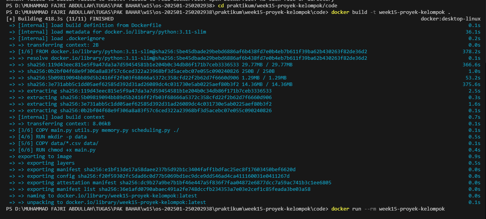
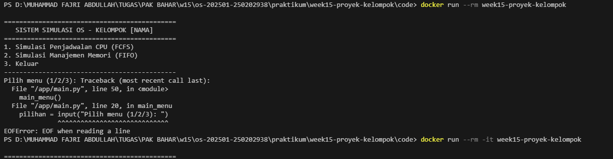
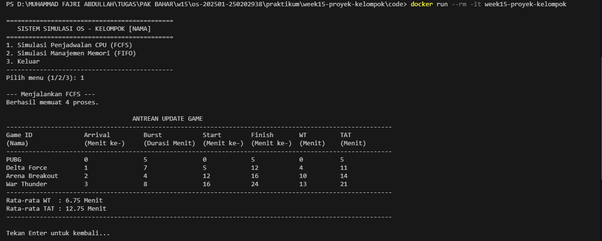
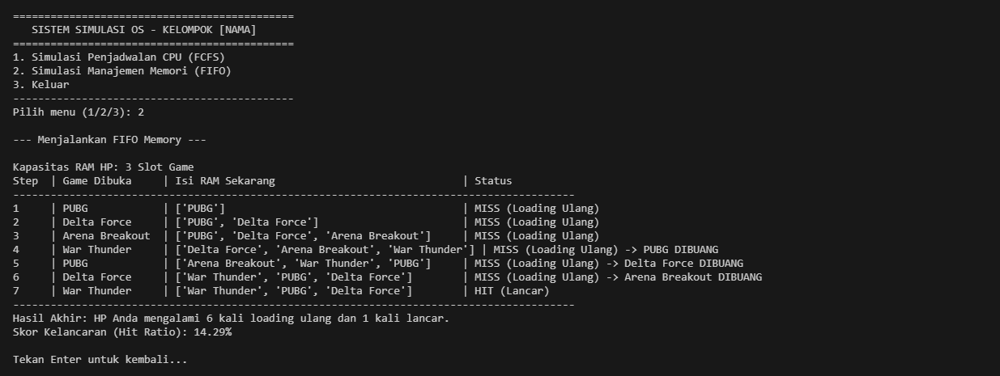

# Laporan Praktikum Kelompok : Mini Simulasi Sistem Operasi


## 1. Pendahuluan
### A. Latar Belakang  
Dalam arsitektur sistem operasi modern, manajemen sumber daya adalah aspek penting untuk memastikan kinerja sistem yang baik. Dua tantangan utama yang dihadapi adalah mengalokasikan waktu pemrosesan CPU secara adil dan mengelola keterbatasan memori fisik (RAM) saat menjalankan berbagai aplikasi secara bersamaan.  
Proyek ini menggunakan studi kasus manajemen ekosistem game, di mana interaksi pengguna sering melibatkan proses pembaruan yang memakan waktu dan membutuhkan memori yang cukup besar saat berpindah antar aplikasi game. Melalui simulasi ini, kami memodelkan dua fenomena utama:  
1. Antrean Update Game: Menggunakan algoritma First-Come, First-Served (FCFS) untuk menangani urutan proses instalasi atau pembaruan berdasarkan waktu kedatangan pengguna (Arrival Time) dan durasi pengerjaan (Burst Time) dihitung secara eksplisit dalam satuan menit. Hal ini memungkinkan kita menganalisis berapa menit seorang pengguna harus menunggu hingga game mereka siap dimainkan.
2. Manajemen Slot RAM: Menggunakan algoritma First-In, First-Out (FIFO) untuk mengelola pergantian aplikasi game dalam RAM yang terbatas (3 slot).  


Tujuan Proyek    
1. Menganalisis efisiensi CPU dengan menghitung metrik kinerja seperti Waiting Time (WT) dan Turnaround Time (TAT) untuk memahami dampak urutan proses terhadap keterlambatan sistem.  
2. Optimasi manajemen memori dengan mengukur keberhasilan akses data melalui metrik Page Faults dan Hit Ratio pada skenario memori terbatas.  
3. Implementasi modular dan portabilitas dengan membangun aplikasi berbasis terminal yang terstruktur secara modular dan dapat dijalankan secara instan menggunakan teknologi kontainer.  
4. Kolaborasi teknis dengan menunjukkan kerja sama tim melalui keterlibatan masing-masing anggota dalam praktikum ini.

---

## 2. Arsitektur Aplikasi (Modul dan Alur Data)
Aplikasi ini dirancang dengan arsitektur modular, di mana setiap fungsi logika dipisahkan ke dalam modul-modul khusus untuk mempermudah integrasi, pengujian, dan pemeliharaan kode . Pendekatan ini memastikan bahwa perubahan pada satu algoritma tidak akan mengganggu stabilitas modul lainnya.

### A. Komponen Modul Utama

- `main.py` (Orchestrator): Berfungsi sebagai entry point utama aplikasi. Modul ini menyediakan antarmuka menu (CLI) yang memungkinkan pengguna berinteraksi dan memilih antara simulasi Penjadwalan CPU atau Manajemen Memori .

- `scheduling.py` (CPU Core): Modul ini berisi implementasi algoritma FCFS. Di dalamnya terdapat fungsi untuk membaca data dari file CSV dan melakukan kalkulasi waktu tunggu (Waiting Time) serta waktu penyelesaian (Turnaround Time) berdasarkan urutan kedatangan data dalam satuan menit .

- `memory.py` (Memory Manager): Modul ini mengelola simulasi Page Replacement menggunakan algoritma FIFO. Logika di dalamnya mensimulasikan bagaimana data game dimasukkan ke dalam slot RAM yang terbatas dan menangani proses eliminasi data tertua saat terjadi Page Fault .

- `utils.py` (Data Access Layer): Berfungsi sebagai penghubung ke penyimpanan eksternal. Modul ini bertanggung jawab menangani file handling untuk membaca dan memproses file dataset dalam folder data/ .

### B. Alur Data (Data Flow)
Sistem ini bekerja dengan mengikuti alur data yang terstruktur:
1. Input Phase: Aplikasi membaca data mentah dari file processes.csv (untuk CPU) dan pages.csv (untuk Memori) melalui modul utils.py.
2. Processing Phase:
- Pada Penjadwalan, data diurutkan berdasarkan Arrival Time sebelum diproses oleh fungsi FCFS .
- Pada Memori, urutan klik aplikasi diproses langkah demi langkah untuk memeriksa ketersediaan slot di dalam memory frame .
3. Output Phase: Hasil akhir ditampilkan kembali ke pengguna dalam bentuk tabel ASCII yang rapi, lengkap dengan statistik metrik performa seperti rata-rata waktu atau Hit Ratio .

---

## 3. Demo Menjalankan Aplikasi (Docker)
Implementasi menggunakan Docker bertujuan untuk menciptakan lingkungan yang terisolasi dan konsisten (reproducible), sehingga aplikasi dapat berjalan di berbagai sistem operasi tanpa perlu menginstal dependensi secara manual.

### A. Spesifikasi Dockerfile
Proyek ini menggunakan base image Python yang ringan (python:3.11-slim) untuk efisiensi ruang penyimpanan. Berdasarkan konfigurasi yang telah ditetapkan, berikut adalah langkah-langkah otomatisasi yang dilakukan oleh Docker:
1. Menetapkan direktori kerja di dalam kontainer pada /app.
2. Menyalin seluruh modul inti (`main.py`, `utils.py`, `memory.py`, dan `scheduling.py`) ke dalam kontainer.
3. Menyiapkan folder `data/` dan menyalin file `dataset .csv` ke dalamnya untuk memastikan ketersediaan input data.

### B. Instruksi Eksekusi Terminal
Aplikasi ini telah dikonfigurasi menggunakan Docker untuk menjamin konsistensi lingkungan eksekusi (reproducible environment). Berikut adalah prosedur standar untuk membangun dan mengoperasikan simulasi:
1. **Persiapan Direktori Kerja** Sebelum menjalankan perintah Docker, pastikan terminal Anda berada di dalam folder yang memuat Dockerfile. Gunakan perintah berikut:

```Bash
cd praktikum/week15-proyek-kelompok/code
```

2. **Tahap Build (Penyusunan Image)** Proses ini bertujuan mengintegrasikan seluruh kode sumber dan dataset ke dalam sebuah paket image terisolasi. Pastikan direktori terminal berada pada folder yang memuat Dockerfile.

```Bash
docker build -t week15-proyek-kelompok .
```
**Dokumentasi**:




3. **Tahap Verifikasi (Quick Demo)** Gunakan perintah berikut untuk melakukan verifikasi cepat apakah aplikasi dapat dieksekusi dalam kontainer. Parameter `--rm` digunakan untuk memastikan kontainer otomatis terhapus setelah proses selesai guna menjaga efisiensi penyimpanan lokal.

```Bash
docker run --rm week15-proyek-kelompok
```

**Dokumentasi**:




4. **Tahap Eksekusi Interaktif** Mengingat aplikasi memerlukan input pengguna untuk navigasi menu, perintah ini wajib menggunakan flag `-it` (Interactive Terminal). Parameter `--rm` ditambahkan untuk memastikan kontainer otomatis terhapus setelah sesi berakhir guna efisiensi penyimpanan.

```Bash
docker run --rm -it week15-proyek-kelompok
```
**Dokumentasi**:


5. **Alur Interaksi Sistem** Setelah kontainer berhasil dijalankan, sistem akan memuat antarmuka Sistem Simulasi OS secara otomatis. Pengguna diharapkan memberikan input angka sesuai dengan menu yang tersedia:
- Input '1': Menjalankan Simulasi Penjadwalan CPU (FCFS).
- Input '2': Menjalankan Simulasi Manajemen Memori (FIFO).
- Input '3': Menghentikan simulasi dan keluar dari kontainer.


---

## 4. Hasil Pengujian & Analisis Singkat
Pengujian dilakukan dengan menggunakan dataset statis yang merepresentasikan beban kerja sistem nyata. Hasil berikut diambil langsung dari output terminal saat aplikasi dijalankan di dalam kontainer Docker.

### A. Analisis Penjadwalan CPU (Algoritma FCFS)

**Hasil Run**: 



Berikut adalah hasil simulasi antrean update game berdasarkan urutan kedatangan (Arrival Time):

| Game ID | Arrival (Menit ke-) | Burst (Durasi Menit) | Start (Menit ke-) | Finish (Menit ke-) | WT (Menit) | TAT (Menit) |
|---|---|---|---|---|---|---|
| PUBG | 0 | 5 | 0 | 5 | 0 | 5 |
| Delta Force | 1 | 7 | 5 | 12 | 4 | 11 |
| Arena Breakout | 2 | 4 | 12 | 16 | 10 | 14 |
| War Thunder |3 |8 |16 |24 | 13 | 21 |

**Ringkasan Metrik CPU:**
- Rata-rata Waiting Time (WT): 6.75 menit.
- Rata-rata urnaround Time (TAT): 12.75 menit.

**Analisis** :
Algoritma FCFS terbukti sangat adil karena memproses update sesuai urutan klik pengguna. Namun, muncul efek *convoy effect* pada game War Thunder yang harus menunggu selama 13 menit (WT tertinggi) meskipun hanya berselisih 3 satuan waktu dari game pertama. Hal ini disebabkan oleh durasi Burst Time game sebelumnya yang cukup besar.
   
### B. Analisis Manajemen Memori (Algoritma FIFO)

Hasil Run:


Simulasi dilakukan dengan kapasitas RAM terbatas sebanyak 3 Slot.

**Hasil Eksekusi**:
- Total Interaksi Game: 7 kali akses.
- Total Page Faults (MISS): Terjadi saat slot RAM penuh dan harus memanggil data dari disk.
- Total Page Hits (HIT): Terjadi saat game yang dibuka sudah ada di salah satu dari 3 slot RAM.
- Hit Ratio: [Persentase Hit].

**Analisis** :
Dengan kapasitas hanya 3 slot, sistem dipaksa melakukan eliminasi terhadap game yang paling lama berada di memori (FIFO) ketika pengguna membuka game ke-4. Strategi ini cukup efisien untuk aplikasi dengan pola akses sekuensial, namun akan menghasilkan banyak Page Fault jika pengguna sering berpindah-pindah antar banyak game secara acak.

---

## 5. Pembagian peran dan kontribusi tiap anggota.
| Nama dan NIM | Peran | Kontribusi |
|:---|:---|:----------|
| Farhan Ramdhani (250202938) | Project Lead & Integrator | <br> - Membuat struktur menu utama di main.py. <br> - Menggabungkan kode FCFS dan FIFO ke branch utama.<br>- Memastikan alur program antar modul tidak bentrok. |
| M. Habibi Nur Ramadhan (250202949) | Developer 1 (CPU Scheduling) | - Membuat logika algoritma FCFS di scheduling.py. <br>- Menghitung otomatis Start, Finish, TAT, dan WT.<br>- Menampilkan hasil penjadwalan dalam bentuk tabel. |
| Andri Dwi Yuliyanto (250202976) | Developer 2 (Page Replacement) |- Mengimplementasikan algoritma FIFO di memory.py. <br>- Menghitung Page Faults. <br>- Menampilkan visualisasi perpindahan frame. |
| Rafi nurul fauzan (250202961) | DevOps & Docker Engineer | - Membuat Dockerfile. <br>- Menangani konfigurasi. <br>- Memastikan aplikasi dapat berjalan di dalam container Docker.|
| Muhammad Fajri Abdullah (250202979 | Data Engineer & QA | - Menyiapkan dataset processes.csv dan pages.csv. <br>- Melakukan testing menyeluruh. <br>- Menyusun dokumentasi laporan.|


---

## Quiz
1. Tantangan terbesar integrasi modul apa, dan bagaimana solusinya?

   **Jawaban:**  
   Tantangan terbesar dalam integrasi modul adalah sinkronisasi aliran data (data flow) antar komponen yang berbeda. Dalam proyek ini, memastikan modul `scheduling.py` dan `memory.py` dapat bekerja secara harmonis saat dipanggil oleh `main.py` tanpa konflik path atau format data adalah kendala utama.
   Solusi:
   - Standardisasi Input/Output: Menggunakan utility function di `utils.py` untuk memuat dataset secara seragam.
   - Manajemen Jalur Relatif: Menggunakan pustaka `os` untuk memastikan skrip dapat menemukan file CSV di dalam folder `data/` baik saat dijalankan di lokal maupun di dalam kontainer Docker.
   - Modularitas: Memisahkan logika algoritma dari antarmuka menu utama agar setiap anggota tim dapat mengerjakan fitur masing-masing di branch Git yang berbeda tanpa saling menimpa kode. 


2. Mengapa Docker membantu proses demo dan penilaian proyek?

   **Jawaban:**  
   Docker sangat membantu karena memberikan kepastian lingkungan eksekusi (*environment consistency*). Seringkali aplikasi gagal berjalan di komputer penilai karena perbedaan versi Python atau dependensi yang hilang.
   Manfaat Utama:
   - Reproduksibilitas: Docker mengisolasi aplikasi dalam kontainer. Seperti pada file Dockerfile proyek ini, kita menggunakan image `python:3.11-slim` untuk memastikan versi Python yang digunakan selalu sama.
   - Kemudahan Deployment: Penilai tidak perlu melakukan instalasi manual. Cukup dengan perintah `docker build` dan `docker run`, seluruh struktur folder dan dataset sudah otomatis tertata di dalam `/app`.
   - Portabilitas: Aplikasi OS simulator ini dapat didemokan dengan hasil yang identik di sistem operasi apa pun (*Windows/Mac/Linux*) tanpa konfigurasi tambahan.


3. Jika dataset diperbesar 10x, modul mana yang paling terdampak performanya? Jelaskan.

   **Jawaban:**  
   Modul CPU Scheduling (FCFS) adalah yang paling terdampak performanya, karena:
   - Beban Pengurutan (Log-Linear): Sebelum menampilkan hasil, modul FCFS harus mengurutkan data berdasarkan waktu kedatangan (ArrivalTime). Secara teknis, mengurutkan data (proses sorting) membutuhkan tenaga CPU yang lebih besar daripada sekadar membaca data biasa. Semakin banyak data, waktu yang dibutuhkan untuk mengurutkan akan meningkat secara "log-linear" (lebih cepat dari garis lurus biasa).
   - Visualisasi Tabel yang Berat: Modul FCFS menghasilkan tabel detail yang panjang dengan banyak kolom (Start, Finish, WT, TAT). Mencetak puluhan atau ratusan baris ke layar terminal (operasi I/O) adalah proses yang lambat bagi komputer dan akan menyebabkan tampilan aplikasi terlihat "tersendat" saat memproses data dalam jumlah besar.
   - Ketergantungan Data: Dalam FCFS, perhitungan satu proses sangat bergantung pada selesainya proses sebelumnya (antrean). Jika data bertambah 10x, rantai antrean yang harus dihitung menjadi jauh lebih panjang dan membebani memori sementara untuk menyimpan seluruh urutan jadwal tersebut.


---

**Credit:**  
_Template laporan praktikum Sistem Operasi (SO-202501) – Universitas Putra Bangsa_
